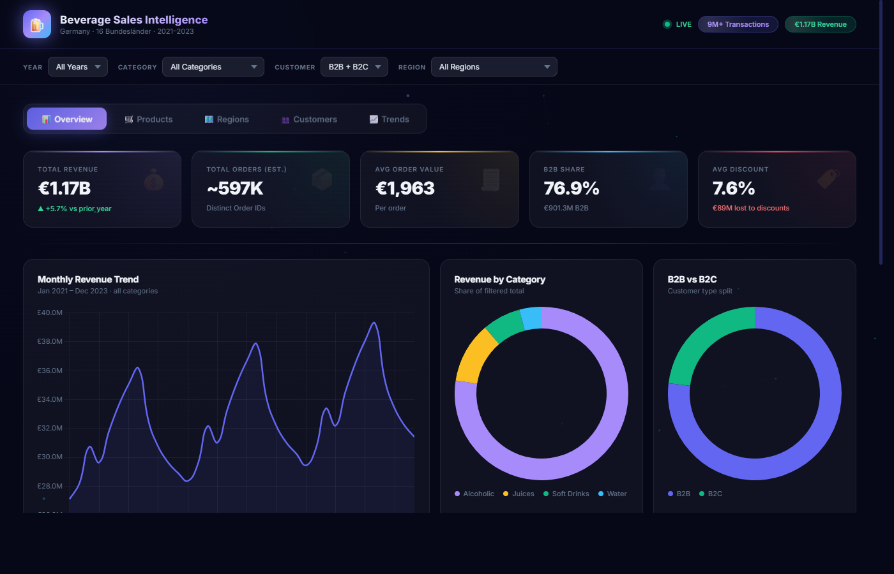

# Beverage Sales Intelligence Dashboard

A business intelligence dashboard built on top of synthetic beverage sales data covering Germany from 2021 to 2023. The dataset includes around 9 million transactions across 16 Bundesländer, 47 products, and two customer segments (B2B and B2C).

The project has two parts: an interactive HTML dashboard you can open directly in a browser, and a full Power BI setup with DAX measures and Power Query transformations if you want to take it further in Power BI Desktop.

---



---

## What's in the data

The dataset covers about €1.18 billion in total revenue across three years. A few things that stand out:

- Alcoholic beverages make up roughly 77% of all revenue, driven largely by premium champagne and spirits
- Veuve Clicquot and Moët & Chandon together account for about a third of total sales
- B2B orders dominate at 76.6% of revenue, with significantly higher average discount rates than B2C
- Revenue grew steadily year over year — from €380M in 2021 to €402M in 2023
- Hamburg, Hessen, and Saarland are consistently the top-performing regions

---

## Dashboard pages

**Overview** — Top-level KPIs, monthly revenue trend, category breakdown, B2B vs B2C split, and a look at how discounts are affecting each category.

**Products** — Top 10 products ranked by revenue, a full product performance table with contribution bars, and a category-level breakdown.

**Regions** — All 16 Bundesländer ranked by revenue, a polar area chart for the top 8, and a full regional performance table.

**Customers** — B2B vs B2C split by year and category, and a stacked view of customer mix across regions.

**Trends** — Multi-category monthly lines, quarter-over-quarter bars, a seasonal radar chart, and year-over-year comparisons.

All five pages respond to the same four filters at the top: Year, Category, Customer Type, and Region. Changing any filter updates every chart and KPI simultaneously.

---

## Running it locally

No dependencies needed for the HTML dashboard. Just clone the repo and open the file:

```bash
git clone https://github.com/Kevin19e/beverage-sales-dashboard
cd beverage-sales-dashboard

# Option 1 — open directly
start Dashboard_Preview.html

# Option 2 — serve with Python
python -m http.server 3000
# then go to http://localhost:3000/Dashboard_Preview.html
```

---

## Power BI setup

If you have Power BI Desktop and the original CSV file, the other files in this repo walk you through the full setup:

1. Load `synthetic_beverage_sales_data.csv` into Power BI Desktop
2. Open the Advanced Editor and apply the transformations in `PowerQuery_Transform.m` — this adds calculated columns for year, quarter, discount tier, gross revenue, and estimated margin
3. Create a separate Date table using the M script in the same file and link it to the main table on `Order_Date`
4. Import the DAX measures from `DAX_Measures.dax` — there are around 50 measures covering revenue, time intelligence, rankings, customer segments, and discount analysis
5. Use `DataModel_Guide.md` as a reference for the star schema layout and the recommended 5-page report structure

---

## Files

```
beverage-sales-dashboard/
├── Dashboard_Preview.html     # Standalone interactive dashboard
├── DAX_Measures.dax           # Power BI DAX measures
├── PowerQuery_Transform.m     # Power Query M transformations + Date table
├── DataModel_Guide.md         # Data model, relationships, page layout guide
└── screenshots/
    └── overview.png
```

---

## Notes

The raw CSV file is not included in this repo because of its size (~9M rows). The HTML dashboard uses a pre-computed data cube built from the same aggregated values, so it works without the source file.

The DAX measures and Power Query scripts are written to work with the original CSV loaded directly into Power BI Desktop using Import mode, which is recommended for this dataset size.
